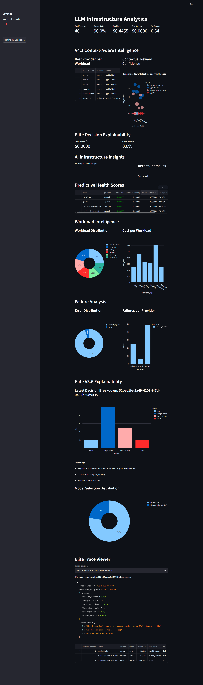

# Model-Mesh (LLM Infrastructure Platform-V4.1)

A production-grade, context-aware LLM routing and observability platform. This system doesn't just route requests—it learns and improves its routing decisions based on real-time outcomes.



## Key Features

- **Context-Aware Routing**: Specialized performance tracking for coding, reasoning, and more.
- **Self-Improving Intelligence**: EMA-based reward learning for latency, cost, and success.
- **Production Guardrails**: Soft budget limits with automated provider downgrading.
- **Deep Observability**: Multi-attempt request tracing with structural explainability.
- **Health-Aware Selector**: Real-time service status monitoring with automatic failover.

## Repository Structure

```bash
llm-infra-platform/
├── src/
│   ├── core/           # Decision engine (Selector, scoring, learning)
│   ├── gateway/        # FastAPI routes and middleware
│   ├── intelligence/   # Insight generation and workload analysis
│   ├── db/             # SQLModel persistence and session
│   ├── monitoring/     # Tracing and metrics
│   ├── cache/          # Prompt caching
│   └── dashboard/      # Streamlit analytics app
├── scripts/            # Simulations, setup, and seed data
├── docs/               # Architecture and Evolution history
└── tests/              # Automated verification
```

## Getting Started

### 1. Installation
```python
pip install -r requirements.txt
```

### 2. Configuration
Create a `.env` file based on `.env.example`:
```env
OPENAI_API_KEY=...
ANTHROPIC_API_KEY=...
GEMINI_API_KEY=...
```

### 3. Setup Database
```bash
python scripts/setup_db.py
```

### 4. Run the Platform
```bash
# Terminal 1: Launch Gateway
python src/main.py

# Terminal 2: Launch Dashboard
streamlit run src/dashboard/app.py
```

### 5. Simulate Traffic
```bash
python scripts/simulate.py --mode v4.1
```

## Documentation
- [Evolution History](docs/evolution.md)
- [Architecture Details](docs/architecture.md)
